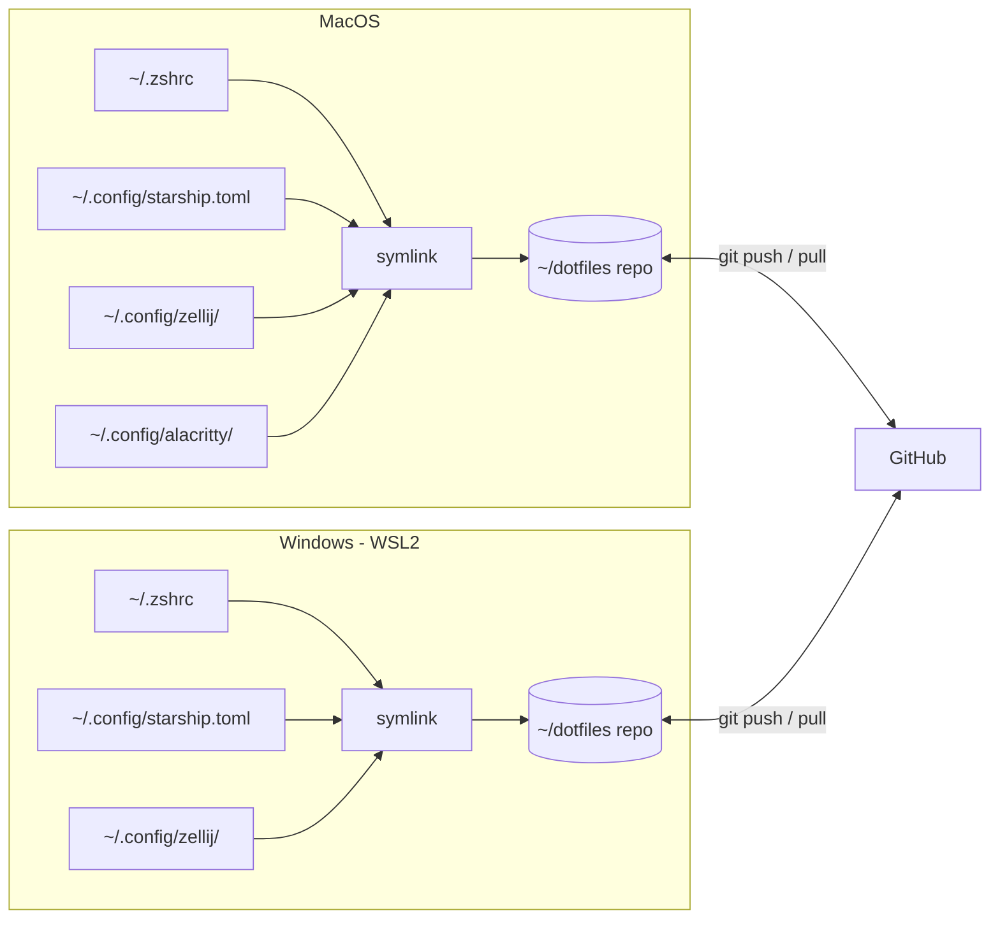
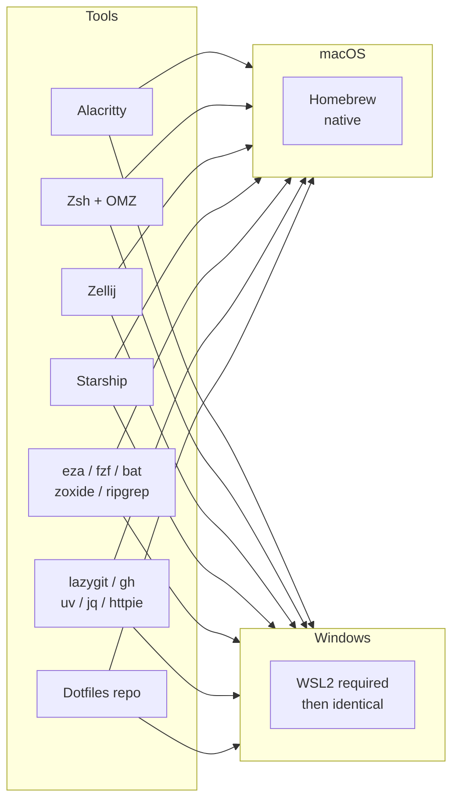

# dotfiles

My terminal setup — configured for macOS and Windows, synced via this repo.

I built this after getting tired of setting up new machines from scratch and having my two machines slowly drift apart. Everything here is version-controlled. A new machine goes from zero to fully configured with one command.

The README doubles as a guide for anyone who wants to adopt the same setup or cherry-pick parts of it.

---

## What problem this solves

Setting up a new machine takes hours. Configs drift between machines. You forget what you installed and why. This repo fixes all three — one script, identical setup everywhere, and a README that explains the reasoning.

---

## The stack

```mermaid
graph TD
    A[You] --> B[Alacritty\nTerminal emulator]
    B --> C[Zsh + Oh My Zsh\nShell]
    C --> D[Zellij\nMultiplexer - panes, tabs, sessions]
    C --> E[Starship\nPrompt]

    subgraph CLI Tools
        F[eza\nFolder trees]
        G[zoxide\nSmart cd]
        H[fzf\nFuzzy search]
        I[bat\nSyntax cat]
        J[ripgrep\nFast grep]
    end

    subgraph Git
        K[lazygit\nVisual git TUI]
        L[gh CLI\nGitHub from terminal]
    end

    subgraph Python
        M[uv\nEnv + packages]
        N[ipython\nREPL]
    end

    subgraph Cloud + APIs
        O[jq\nJSON processing]
        P[httpie\nAPI testing]
        Q[aws / gcloud / az\nCloud CLIs]
    end

    C --> CLI Tools
    C --> Git
    C --> Python
    C --> Cloud + APIs
```

---

## How it works across two machines



Config files live in this repo. `install.sh` creates symlinks from where tools expect them to where the repo actually stores them. Change a config on one machine, push, pull on the other. Done.

---

## Platform compatibility



Everything runs on both platforms. On Windows, WSL2 is the required foundation — it gives you a real Linux environment. Once WSL2 is running, the install script is identical.

---

## Before you start — manual steps

Two things need to be done by hand. Everything else is scripted.

### 1. Install a Nerd Font

Required for icons in eza and Starship.

**macOS:** handled by `install.sh` via Homebrew Cask.

**Windows:**
1. Download JetBrainsMono Nerd Font from https://www.nerdfonts.com/font-downloads
2. Extract the zip
3. Select all `.ttf` files, right-click, choose "Install for all users"
4. Set the font in Windows Terminal: Settings > your WSL2 profile > Appearance > Font face

### 2. Install Alacritty on Windows

**macOS:** handled by `install.sh`.

**Windows:** download the `.msi` from https://github.com/alacritty/alacritty/releases and run it. After install, edit `%APPDATA%\alacritty\alacritty.toml` — a sample is in `configs/alacritty/alacritty.toml` in this repo.

**That's it.** Everything from here is scripted.

---

## Install

### macOS

```bash
# 1. Clone this repo
git clone git@github.com:YOURUSERNAME/dotfiles.git ~/dotfiles

# 2. Run the install script
cd ~/dotfiles && ./install.sh
```

### Windows (WSL2)

```powershell
# 1. Install WSL2 — run in PowerShell as Administrator
wsl --install
# Restart when prompted, then open Ubuntu from Start menu
```

```bash
# 2. Inside WSL2, clone and run
git clone git@github.com:YOURUSERNAME/dotfiles.git ~/dotfiles
cd ~/dotfiles && ./install.sh
```

The script:
- Installs Homebrew if missing
- Installs all packages from `Brewfile`
- Installs Oh My Zsh and plugins
- Symlinks all config files into place
- Backs up anything it would overwrite

---

## What gets installed

Everything is declared in `Brewfile`. To install packages only (without symlinking configs):

```bash
brew bundle --file=Brewfile
```

To see what's installed vs what's in the Brewfile:

```bash
brew bundle check --file=Brewfile
```

---

## Repo structure

```
dotfiles/
├── README.md
├── install.sh            # run this on a new machine
├── Brewfile              # all packages — used by install.sh
├── configs/
│   ├── alacritty/
│   │   └── alacritty.toml
│   ├── starship/
│   │   └── starship.toml
│   ├── zellij/
│   │   ├── config.kdl
│   │   └── layouts/
│   │       └── dev.kdl
│   └── zsh/
│       └── .zshrc
└── scripts/
    └── check-updates.sh  # see: Keeping it current
```

---

## Key tools — quick reference

### Alacritty

GPU-accelerated terminal emulator. Configured via a single TOML file. No tabs, no splits — that's Zellij's job.

### Zellij

Terminal multiplexer. Gives you panes, tabs, and sessions that survive closing the terminal. Press `Ctrl+p` for pane controls, `Ctrl+t` for tabs. Keybindings are shown at the bottom of the screen — no need to memorise them.

The default layout (`configs/zellij/layouts/dev.kdl`) opens three panes:

```
┌─────────────────────┬────────────────────┐
│                     │                    │
│   main shell        │   lazygit          │
│                     │                    │
│                     ├────────────────────┤
│                     │                    │
│                     │   server / logs    │
│                     │                    │
└─────────────────────┴────────────────────┘
```

### Starship

Replaces the default shell prompt. Shows what you need: current directory, git branch, git status, Python env, cloud context. Renders in milliseconds.

Config is in `configs/starship/starship.toml`. Key things it shows:
- Git branch and dirty/clean status
- Python virtualenv when active
- AWS/GCP/Azure context when credentials are set
- How long the last command took (if over 3 seconds)

### lazygit

A full git UI in the terminal. Open it with `lg` (aliased in `.zshrc`).

Common keys:
- `space` — stage a file
- `c` — commit
- `P` — push
- `p` — pull
- `b` — branch management
- `?` — show all keybindings

### eza

Replaces `ls`. Aliases set up in `.zshrc`:

```bash
ls   # eza with icons
ll   # long listing with git status
lt   # tree view (2 levels)
la   # long listing including hidden files
```

### uv

Replaces `pip`, `venv`, and `pyenv` in one tool. Faster than all three.

```bash
uv venv                    # create a virtual environment
uv pip install requests    # install a package
uv python install 3.12     # install a Python version
uv run script.py           # run a script
```

### fzf

Fuzzy finder. After install, three keybindings are available everywhere:
- `Ctrl+R` — fuzzy search command history
- `Ctrl+T` — fuzzy search files in current directory
- `Alt+C` — fuzzy cd into a subdirectory

### jq + httpie

Use together for API work:

```bash
# Call an API, filter the JSON response
http GET api.example.com/data | jq '.results[] | {id, name}'

# POST with JSON body
http POST api.example.com/items name="test" value:=42
```

---

## Keeping it current

### Update all tools

```bash
brew update && brew upgrade
```

Run this weekly or whenever you start a new project.

### Check for config drift between machines

```bash
cd ~/dotfiles
git status    # see if anything has changed locally but not been committed
git diff      # see what changed
```

If you edited a config directly (not via the repo), the symlink means the change is already in the repo. Just commit it:

```bash
git add configs/starship/starship.toml
git commit -m "update starship config"
git push
```

Then on the other machine:

```bash
cd ~/dotfiles && git pull
# No need to re-run install.sh — symlinks are already in place
```

### Check if your Brewfile is still accurate

Over time you may install extra tools manually. To capture them:

```bash
brew bundle dump --force --file=Brewfile
git diff Brewfile    # review what changed
git add Brewfile && git commit -m "update Brewfile"
```

### Dealing with version differences between machines

The `Brewfile` records package names but not versions — Homebrew always installs the latest. In practice this rarely causes problems. If you hit a case where a specific version matters (Python, Node), manage that with `uv` (Python) or `nvm`/`.nvmrc` (Node) rather than trying to pin via Homebrew.

To check whether your two machines are in sync:

```bash
# Run on each machine and compare output
brew list --versions | sort > /tmp/brew-$(hostname).txt
```

### Scheduled check (optional)

`scripts/check-updates.sh` can be added as a weekly cron job:

```bash
chmod +x scripts/check-updates.sh

# Add to crontab — runs every Monday at 9am
crontab -e
# Add: 0 9 * * 1 ~/dotfiles/scripts/check-updates.sh
```

---

## Adding a new tool

1. Install it: `brew install <tool>`
2. Add any config to `configs/`
3. Add a symlink to `install.sh`
4. Update the Brewfile: `brew bundle dump --force --file=Brewfile`
5. Add aliases to `configs/zsh/.zshrc` if useful
6. Commit and push

```bash
git add .
git commit -m "add <tool>"
git push
```

---

## Troubleshooting

**Icons not showing**
Check the font is set correctly in Alacritty config (`font.normal.family`). Must be a Nerd Font variant — plain JetBrainsMono will not show icons.

**Zellij not starting automatically**
Check `.zshrc` has the auto-start block and that you've sourced it: `source ~/.zshrc`

**Starship not showing git info**
Make sure you're inside a git repo. Run `git status` to confirm it's initialised.

**brew command not found on WSL2**
Run: `eval "$(/home/linuxbrew/.linuxbrew/bin/brew shellenv)"` then add that line to `~/.zshrc` permanently.

**fzf keybindings not working**
Run: `$(brew --prefix)/opt/fzf/install` and follow the prompts to enable shell integration.

---

## Further reading

- [Alacritty docs](https://alacritty.org)
- [Starship config reference](https://starship.rs/config/)
- [Zellij docs](https://zellij.dev/documentation/)
- [eza docs](https://github.com/eza-community/eza)
- [lazygit keybindings](https://github.com/jesseduffield/lazygit/blob/master/docs/keybindings)
- [uv docs](https://docs.astral.sh/uv/)
- [fzf docs](https://github.com/junegunn/fzf)
- [jq manual](https://jqlang.github.io/jq/manual/)

---

> Built with assistance from Claude (Anthropic). Tool choices, structure, and config decisions are my own.
