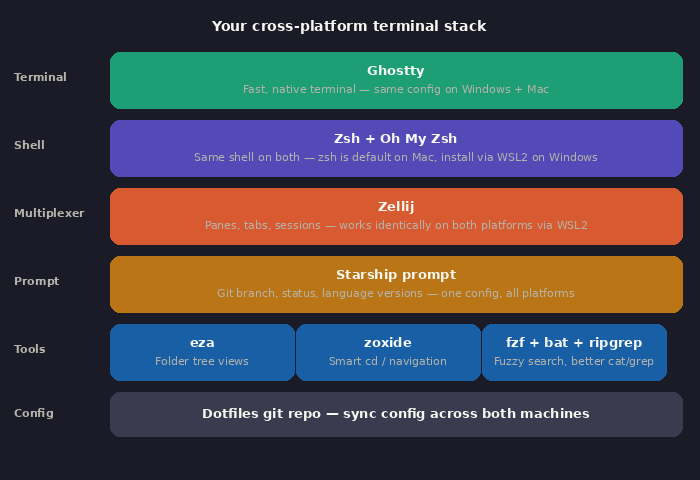
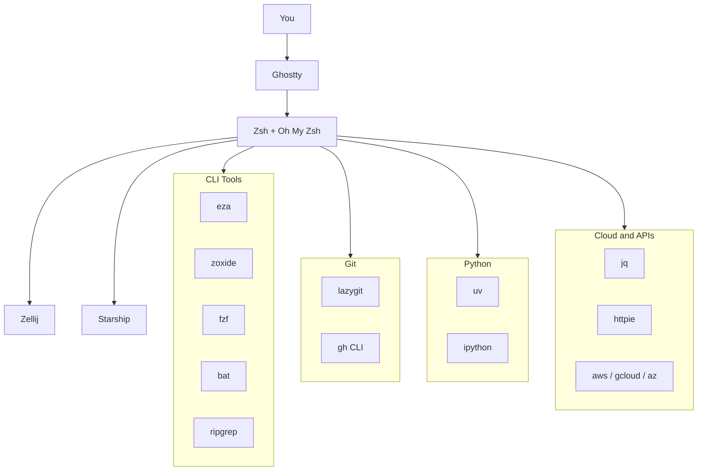
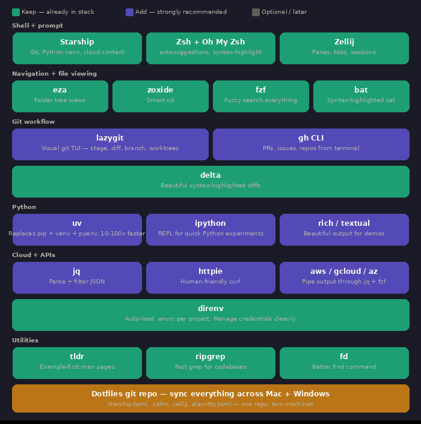
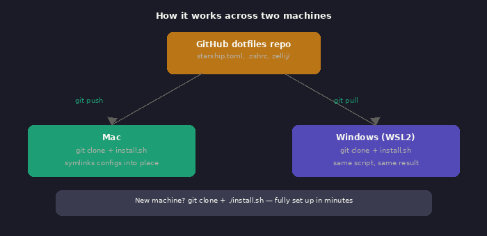
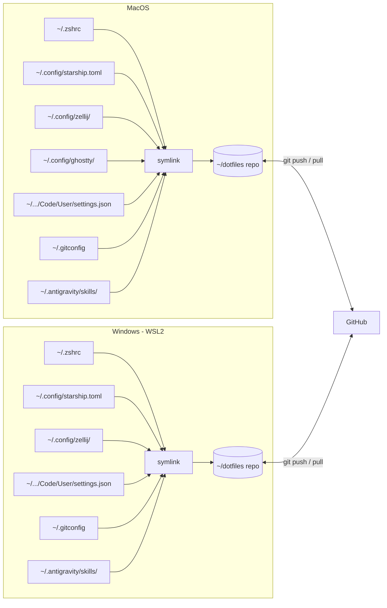
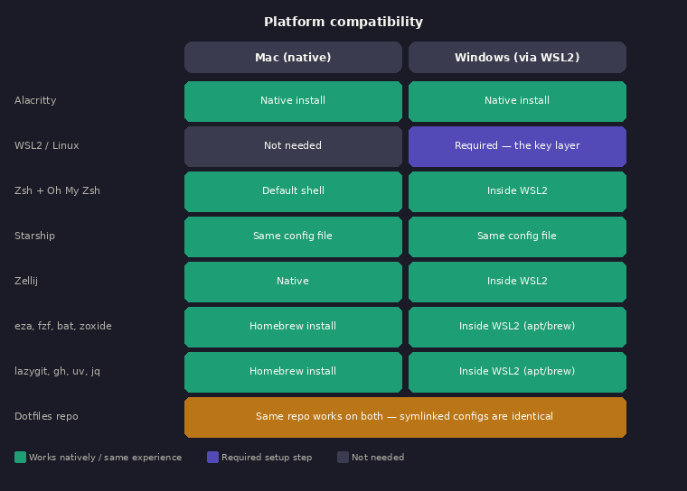
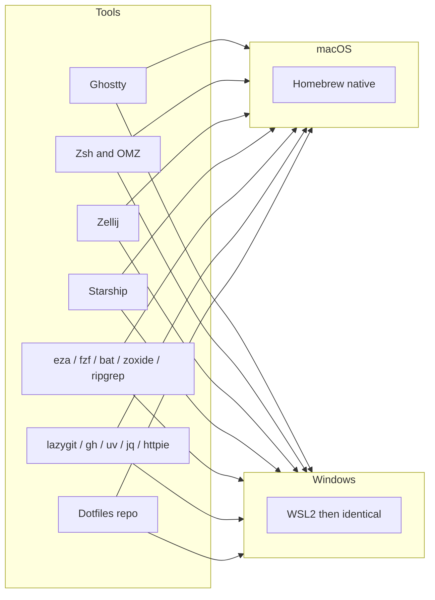

# dotfiles

My terminal setup — configured for macOS and Windows, synced via this repo.

I built this after getting tired of setting up new machines from scratch and having my two machines slowly drift apart. Everything here is version-controlled. A new machine goes from zero to fully configured with one command.

The README doubles as a guide for anyone who wants to adopt the same setup or cherry-pick parts of it.

> See also [`ai-config`](../ai-config) — a sibling repo for AI coding agent instructions and skills (Claude Code, opencode, etc.), kept separate since it covers a different concern than this repo's terminal/editor/tool configuration.

---

## What problem this solves

Setting up a new machine takes hours. Configs drift between machines. You forget what you installed and why. This repo fixes all three — one script, identical setup everywhere, and a README that explains the reasoning.

---

## The stack



<details>
<summary>View diagram source</summary>


```mermaid
graph TD
    A[You] --> B[Ghostty]
    B --> C[Zsh + Oh My Zsh]
    C --> D[Zellij]
    C --> E[Starship]

    subgraph CLITools[CLI Tools]
        F[eza]
        G[zoxide]
        H[fzf]
        I[bat]
        J[ripgrep]
    end

    subgraph GitTools[Git]
        K[lazygit]
        L[gh CLI]
    end

    subgraph PythonTools[Python]
        M[uv]
        N[ipython]
    end

    subgraph CloudTools[Cloud and APIs]
        O[jq]
        P[httpie]
        Q[aws / gcloud / az]
    end

    C --> CLITools
    C --> GitTools
    C --> PythonTools
    C --> CloudTools
```

</details>

---

## Why these tools

Not every tool is equal priority. This shows what's core to the setup, what's strongly recommended, and what you can add later.



---

## How it works across two machines



<details>
<summary>View diagram source</summary>


```mermaid
flowchart LR
    subgraph mac [MacOS]
        M1[~/.zshrc] --> ML[symlink]
        M2[~/.config/starship.toml] --> ML
        M3[~/.config/zellij/] --> ML
        M4[~/.config/ghostty/] --> ML
        M5[~/.../Code/User/settings.json] --> ML
        M6[~/.gitconfig] --> ML
        M7[~/.antigravity/skills/] --> ML
        ML --> MR[(~/dotfiles repo)]
    end

    subgraph win [Windows - WSL2]
        W1[~/.zshrc] --> WL[symlink]
        W2[~/.config/starship.toml] --> WL
        W3[~/.config/zellij/] --> WL
        W4[~/.../Code/User/settings.json] --> WL
        W5[~/.gitconfig] --> WL
        W6[~/.antigravity/skills/] --> WL
        WL --> WR[(~/dotfiles repo)]
    end

    MR <-->|git push / pull| GH[GitHub]
    WR <-->|git push / pull| GH
```

</details>

Config files live in this repo. `install.sh` creates symlinks from where tools expect them to where the repo actually stores them. Change a config on one machine, push, pull on the other. Done.

---

## Platform compatibility



<details>
<summary>View diagram source</summary>


```mermaid
graph LR
    subgraph ToolsGroup[Tools]
        T1[Ghostty]
        T2[Zsh and OMZ]
        T3[Zellij]
        T4[Starship]
        T5[eza / fzf / bat / zoxide / ripgrep]
        T6[lazygit / gh / uv / jq / httpie]
        T7[Dotfiles repo]
    end

    subgraph MacGroup[macOS]
        MA[Homebrew native]
    end

    subgraph WinGroup[Windows]
        WA[WSL2 then identical]
    end

    T1 --> MacGroup
    T1 --> WinGroup
    T2 --> MacGroup
    T2 --> WinGroup
    T3 --> MacGroup
    T3 --> WinGroup
    T4 --> MacGroup
    T4 --> WinGroup
    T5 --> MacGroup
    T5 --> WinGroup
    T6 --> MacGroup
    T6 --> WinGroup
    T7 --> MacGroup
    T7 --> WinGroup
```

</details>

Everything runs on both platforms. On Windows, WSL2 is the required foundation — it gives you a real Linux environment. Once WSL2 is running, the install script is identical.

---

## Before you start — manual steps

Two things need to be done by hand. Everything else is scripted.

### 1. Install a Nerd Font

Required for icons in eza and Starship.

**macOS:** handled by `install.sh` via Homebrew Cask.

**Windows:**

1. Download JetBrainsMono Nerd Font from <https://www.nerdfonts.com/font-downloads>
2. Extract the zip
3. Select all `.ttf` files, right-click, choose "Install for all users"
4. Set the font in Windows Terminal: Settings > your WSL2 profile > Appearance > Font face

### 2. Install Alacritty on Windows

**macOS:** uses Ghostty — handled by `install.sh`.
**Windows:** download the `.msi` from <https://github.com/alacritty/alacritty/releases> and run it.
After install, copy `configs/alacritty/alacritty.toml` to `%APPDATA%\alacritty\alacritty.toml`.

**That's it.** Everything from here is scripted.

---

## Install

### macOS

```bash
# 1. Clone this repo
git clone git@github.com:YOURUSERNAME/dotfiles.git ~/dotfiles

# 2. Run the install script
cd ~/dotfiles && ./install.sh
```

### Windows (WSL2)

```powershell
# 1. Install WSL2 — run in PowerShell as Administrator
wsl --install
# Restart when prompted, then open Ubuntu from Start menu
```

```bash
# 2. Inside WSL2, clone and run
git clone git@github.com:YOURUSERNAME/dotfiles.git ~/dotfiles
cd ~/dotfiles && ./install.sh
```

The script:

- Installs Homebrew if missing
- Installs all packages from `Brewfile`
- Installs Oh My Zsh and plugins
- Installs nvm + Node.js LTS and sets up fzf shell integration
- Symlinks all config files into place (shell, git, prompt, VS Code, Antigravity skills)
- Creates `~/.secrets` from the template if missing
- Backs up anything it would overwrite

It is idempotent — safe to re-run any time.

**After the script completes, run through these steps once:**

**1. Restart your terminal (or reload the shell)**

```bash
exec zsh
```

**2. Confirm the terminal font**

macOS: open `~/.config/ghostty/config` (symlinked to `configs/ghostty/config`) and confirm `font-family = JetBrainsMonoNL Nerd Font Mono`. Windows uses Alacritty instead — the font is set in `configs/alacritty/alacritty.toml`.

**3. Authenticate the GitHub CLI**

```bash
gh auth login
```

Opens a browser, walks you through signing in, stores a token. One-time per machine.

**4. Set your git identity**

If this is a fresh machine, git won't know who you are yet:

```bash
git config --global user.name "Your Name"
git config --global user.email "you@example.com"
```

**5. Install a Python version**

`uv` is installed but has no Python yet:

```bash
uv python install 3.12
```

**6. Install Node.js via nvm**

nvm and Node LTS are installed automatically by the script. To verify:

```bash
node --version
npm --version
```

To install a specific version manually:

```bash
nvm install 20
nvm use 20
```

**7. Authenticate cloud CLIs (as needed)**

```bash
aws configure                  # AWS
gcloud auth login              # GCP
az login                       # Azure
```

You only need to do whichever ones are relevant to your work.

**8. Add your API keys to `~/.secrets`**

The script created `~/.secrets` (mode 600) from `configs/zsh/.secrets.example`.
Put your API keys there — the file is sourced by `.zshrc` on every shell and
is never committed. Long-term key storage lives in Bitwarden (`rbw` CLI).

---

## What gets installed

Everything is declared in `Brewfile`. To install packages only (without symlinking configs):

```bash
brew bundle --file=Brewfile
```

To see what's installed vs what's in the Brewfile:

```bash
brew bundle check --file=Brewfile
```

---

## Repo structure

```none
dotfiles/
├── AGENTS.md             # AI agent instructions (single source)
├── CLAUDE.md             # pointer — imports AGENTS.md
├── README.md             # this file: overview + setup
├── CHEATSHEET.md         # full command reference for every tool
├── QUICK-REF.md          # one-glance card, links into docs/
├── Brewfile              # all packages — used by install.sh
├── install.sh            # run this on a new machine (forwards to scripts/install.sh)
├── .markdownlint.json
├── configs/
│   ├── alacritty/
│   │   └── alacritty.toml
│   ├── antigravity/
│   │   └── skills/       # global AI agent skills (5 skills, one dir each)
│   ├── ghostty/
│   │   └── config
│   ├── git/
│   │   ├── .gitconfig
│   │   └── .gitconfig.local.example
│   ├── starship/
│   │   └── starship.toml
│   ├── vscode/
│   │   └── settings.json # shared by VS Code + Antigravity
│   ├── zellij/
│   │   ├── config.kdl
│   │   └── layouts/
│   │       └── dev.kdl
│   └── zsh/
│       ├── .zshrc
│       └── .secrets.example  # template for ~/.secrets
├── docs/
│   ├── editor.md         # per-topic references (linked from QUICK-REF)
│   ├── git.md
│   ├── markdown.md
│   ├── node.md
│   ├── python.md
│   ├── terminal.md
│   └── dev-setup/        # extensions audit, Python/Node setup guides
├── scripts/
│   ├── agents-welcome.sh # AI-agents banner for new shells
│   ├── check-updates.sh  # weekly update checker (cron, not run by install.sh)
│   ├── dotfiles.sh       # manager: help | install | sync | audit
│   └── install.sh        # the real bootstrap (root install.sh forwards here)
└── images/               # diagrams used in this README
```

---

## Key tools — at a glance

Every command for every tool lives in **[CHEATSHEET.md](CHEATSHEET.md)** (the
single command reference). **[QUICK-REF.md](QUICK-REF.md)** is the one-glance
card that links into `docs/*.md` for depth. This table is just the map:

| Tool | What it does | Config lives in |
| --- | --- | --- |
| Ghostty / Alacritty | Terminal (macOS / Windows) | `configs/ghostty/`, `configs/alacritty/` |
| Zellij | Multiplexer — panes, tabs, sessions (`Ctrl+p` / `Ctrl+t`) | `configs/zellij/` |
| Starship | Prompt — git, venv, cloud context | `configs/starship/starship.toml` |
| lazygit (`lg`) | Full git UI in the terminal | — |
| eza (`ls`, `ll`, `lt`) | Better `ls` — icons, git status, tree view | aliases in `.zshrc` |
| bat (`cat`) | Syntax-highlighted pager | alias in `.zshrc` |
| fd | Faster, friendlier `find` | — |
| ripgrep (`rg`) | Fast recursive content search | — |
| zoxide (`z` / `cdz`) | Jump to frequent dirs — plain `cd` stays vanilla | `.zshrc` |
| fzf | Fuzzy finder (`Ctrl+R` history, `Ctrl+T` files, `Alt+C` dirs) | `.zshrc` |
| uv | `pip` + `venv` + `pyenv` in one fast tool | — |
| nvm | Node.js version manager | — |
| jq + httpie | JSON filtering + friendly HTTP for API work | — |
| delta | Readable git diffs (auto in lazygit too) | git pager via `.zshrc` |
| direnv | Per-project env vars from `.envrc` | — |
| rbw + Bitwarden | Password manager + unofficial CLI; runtime keys in `~/.secrets` | `configs/zsh/.secrets.example` |
| tldr | Example-first man pages | — |

---

## Antigravity Skills

Global AI agent skills for the Antigravity IDE, symlinked to `~/.antigravity/skills/` automatically by `install.sh`.

These are reusable across all projects — no project-specific setup needed to use them.

| Skill             | Use for                                  |
| ----------------- | ---------------------------------------- |
| `backend-dev`     | Python, FastAPI, CLI tools               |
| `frontend-dev`    | Next.js, TypeScript, Tailwind, shadcn/ui |
| `reviewer`        | Code review checklist                    |
| `tester-backend`  | pytest patterns and mocking              |
| `tester-frontend` | Vitest, React Testing Library            |

### Two-level skill system

Skills work at two levels:

**Global skills** (`~/.antigravity/skills/`) — this repo. Generic best practices, reusable across all projects.

**Project skills** (`.antigravity/skills/` in project root) — thin overrides that extend global skills with project-specific context (folder structure, API contracts, sprint status).

### Adding project-specific context

In any project, create `.antigravity/skills/backend-dev/SKILL.md`:

```markdown
# Backend Developer — myproject

## Extends

Global backend-dev skill — see ~/.antigravity/skills/backend-dev/SKILL.md

## Project-specific additions

- Project-specific patterns
- Project folder structure
- Before starting — read AGENTS.md
```

### Updating skills

Edit files in `configs/antigravity/skills/`, commit and push. All machines update automatically on next `git pull` — no need to re-run `install.sh`.

---

## Keeping it current

### One command for everything

```bash
./scripts/dotfiles.sh          # help
./scripts/dotfiles.sh install  # full bootstrap (new machine)
./scripts/dotfiles.sh sync     # git pull + re-apply (idempotent)
./scripts/dotfiles.sh audit    # drift report: symlinks, packages, extensions, secrets
```

### Update all tools

```bash
brew update && brew upgrade
```

Run this weekly or whenever you start a new project. On Mac, run this in any terminal. On Windows, run it inside WSL2 — it won't work in PowerShell or Git Bash.

### Check for config drift between machines

```bash
cd ~/dotfiles
git status    # see if anything has changed locally but not been committed
git diff      # see what changed
```

If you edited a config directly (not via the repo), the symlink means the change is already in the repo. Just commit it:

```bash
git add configs/starship/starship.toml
git commit -m "update starship config"
git push
```

Then on the other machine:

```bash
cd ~/dotfiles && git pull
# No need to re-run install.sh — symlinks are already in place
```

### Check if your Brewfile is still accurate

Over time you may install extra tools manually. To capture them:

```bash
brew bundle dump --force --file=Brewfile
git diff Brewfile    # review what changed
git add Brewfile && git commit -m "update Brewfile"
```

### Dealing with version differences between machines

The `Brewfile` records package names but not versions — Homebrew always installs the latest. In practice this rarely causes problems. If you hit a case where a specific version matters (Python, Node), manage that with `uv` (Python) or `nvm`/`.nvmrc` (Node) rather than trying to pin via Homebrew.

To check whether your two machines are in sync:

```bash
# Run on each machine and compare output
brew list --versions | sort > /tmp/brew-$(hostname).txt
```

### Scheduled check (optional)

`scripts/check-updates.sh` can be added as a weekly cron job:

```bash
chmod +x scripts/check-updates.sh

# Add to crontab — runs every Monday at 9am
crontab -e
# Add: 0 9 * * 1 ~/dotfiles/scripts/check-updates.sh
```

---

## Adding a new tool

1. Install it: `brew install <tool>`
2. Add any config to `configs/`
3. Add a symlink to `install.sh`
4. Update the Brewfile: `brew bundle dump --force --file=Brewfile`
5. Add aliases to `configs/zsh/.zshrc` if useful
6. Commit and push

```bash
git add .
git commit -m "add <tool>"
git push
```

---

## Troubleshooting

**Icons not showing**
Check the font is set correctly in Ghostty config (`font-family` in `configs/ghostty/config`). Must be a Nerd Font variant — plain JetBrainsMono will not show icons.

**Zellij not starting automatically**
Check `.zshrc` has the auto-start block and that you've sourced it: `source ~/.zshrc`

**Starship not showing git info**
Make sure you're inside a git repo. Run `git status` to confirm it's initialised.

**brew command not found on WSL2**
Run: `eval "$(/home/linuxbrew/.linuxbrew/bin/brew shellenv)"` then add that line to `~/.zshrc` permanently.

**fzf keybindings not working**
Run: `$(brew --prefix)/opt/fzf/install` and follow the prompts to enable shell integration.

---

## Further reading

- [Ghostty docs](https://ghostty.org)
- [Starship config reference](https://starship.rs/config/)
- [Zellij docs](https://zellij.dev/documentation/)
- [eza docs](https://github.com/eza-community/eza)
- [lazygit keybindings](https://github.com/jesseduffield/lazygit/tree/master/docs/keybindings)
- [uv docs](https://docs.astral.sh/uv/)
- [fzf docs](https://github.com/junegunn/fzf)
- [jq manual](https://jqlang.github.io/jq/manual/)
- [tldr pages](https://tldr.sh)
- [delta docs](https://dandavison.github.io/delta/)
- [direnv docs](https://direnv.net)
- [Quick Reference](QUICK-REF.md) — quick reference for every tool in this setup (and some more)

---

> Built with assistance from Claude (Anthropic). Tool choices, structure, and config decisions are my own.
