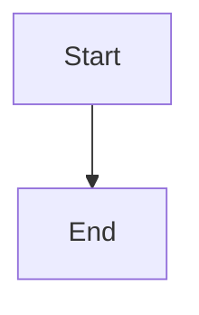

# Markdown

[← Back to Quick Reference](../QUICK-REF.md)

---

## Syntax

### Text formatting

| Syntax | Output |
|---|---|
| `**bold**` | **bold** |
| `*italic*` | *italic* |
| `~~strikethrough~~` | ~~strikethrough~~ |
| `` `inline code` `` | `inline code` |
| `**_bold italic_**` | ***bold italic*** |

### Headings

```markdown
# H1
## H2
### H3
#### H4
```

### Lists

```markdown
- Unordered item
- Another item
  - Nested item

1. Ordered item
2. Second item
   1. Nested ordered

- [x] Completed task
- [ ] Pending task
```

### Links + images

| Syntax | What it does |
|---|---|
| `[text](url)` | Link |
| `[text](url "title")` | Link with tooltip |
| `` | Image |
| `` | Image with tooltip |
| `[text][ref]` then `[ref]: url` | Reference link |

### Code

````markdown
`inline code`

```python
def hello():
    print("Hello")
```
````

### Tables

```markdown
| Column 1 | Column 2 | Column 3 |
|---|---|---|
| Cell | Cell | Cell |
| Cell | Cell | Cell |
```

Alignment:
```markdown
| Left | Center | Right |
|:---|:---:|---:|
| text | text | text |
```

### Blockquotes

```markdown
> Single quote

> Nested
>> Deeper nested
```

### Horizontal rule

```markdown
---
```

### Line breaks

| Syntax | What it does |
|---|---|
| Two spaces at end of line | Line break |
| Blank line between text | New paragraph |
| `<br>` | Explicit line break |

---

## GitHub Flavored Markdown (GFM)

### Alerts (GitHub only)

```markdown
> [!NOTE]
> Useful information

> [!TIP]
> Helpful tip

> [!IMPORTANT]
> Critical information

> [!WARNING]
> Risky content

> [!CAUTION]
> Negative consequences
```

### Collapsible sections

```markdown
<details>
<summary>Click to expand</summary>

Hidden content here.

</details>
```

### Mermaid diagrams

````markdown

````

### Footnotes

```markdown
Text with footnote[^1]

[^1]: Footnote content here.
```

---

## Antigravity shortcuts for markdown

| Shortcut | What it does |
|---|---|
| `Ctrl+Shift+V` | Open preview |
| `Ctrl+B` | Bold selected |
| `Ctrl+I` | Italic selected |
| `Ctrl+Shift+]` | Increase heading level |
| `Ctrl+Shift+[` | Decrease heading level |
| `Ctrl+Shift+P` → `Create Table of Contents` | Insert TOC |

---

## Tips

- Use `---` to separate major sections
- Keep line length under 120 chars for readability in editors
- Use reference-style links for URLs used multiple times
- GitHub renders `CHEATSHEET.md`, `README.md`, and any `.md` file automatically
- Outline panel in Antigravity (`Ctrl+Shift+E` → scroll to Outline) shows all headings for navigation
