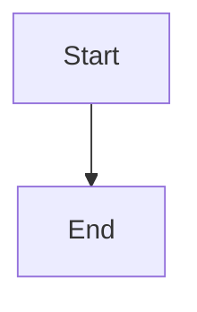

# 📝 Markdown

[← Quick Reference](../QUICK-REF.md)

## ✍️ Syntax

<table><tr><td width="33%">

### Text + headings

| Syntax | Output |
|---|---|
| `# H1` | Heading 1 |
| `## H2` | Heading 2 |
| `### H3` | Heading 3 |
| `**bold**` | **bold** |
| `*italic*` | *italic* |
| `~~strike~~` | ~~strike~~ |
| `` `code` `` | `code` |
| `**_bold italic_**` | ***bold italic*** |

### Links + images

| Syntax | What it does |
|---|---|
| `[text](url)` | Link |
| `[text](url "tip")` | Link + tooltip |
| `` | Image |
| `[text][ref]` | Reference link |
| `[ref]: url` | Define reference |

</td><td width="33%">

### Lists

```markdown
- Unordered
  - Nested

1. Ordered
   1. Nested

- [x] Done
- [ ] Todo
```

### Code

````markdown
`inline code`

```python
def hello():
    print("hi")
```
````

### Tables

```markdown
| Col 1 | Col 2 |
|---|---|
| cell | cell |

| Left | Center | Right |
|:---|:---:|---:|
```

</td><td width="33%">

### Blockquotes + dividers

```markdown
> Quote

> Nested
>> Deeper

---
```

### Line breaks

| Syntax | What it does |
|---|---|
| Two spaces at end | Line break |
| Blank line | New paragraph |
| `<br>` | Explicit break |

### Shortcuts (Antigravity)

| Shortcut | What it does |
|---|---|
| `Ctrl+Shift+V` | Preview |
| `Ctrl+B` | Bold |
| `Ctrl+I` | Italic |
| `Ctrl+Shift+]` | Heading up |
| `Ctrl+Shift+[` | Heading down |

</td></tr></table>

---

## 🐙 GitHub Flavored Markdown

<table><tr><td width="50%">

### Alerts

```markdown
> [!NOTE]
> Useful information

> [!TIP]
> Helpful tip

> [!IMPORTANT]
> Critical info

> [!WARNING]
> Risky content

> [!CAUTION]
> Negative consequences
```

### Collapsible

```markdown
<details>
<summary>Click to expand</summary>

Hidden content here.

</details>
```

</td><td width="50%">

### Mermaid diagrams

````markdown

````

### Footnotes

```markdown
Text[^1]

[^1]: Footnote here.
```

### Tips

- Use `---` to separate sections
- GitHub renders any `.md` file automatically
- Use Outline panel in Antigravity for navigation
- Reference-style links for repeated URLs
- Keep lines under 120 chars for editor readability

</td></tr></table>
